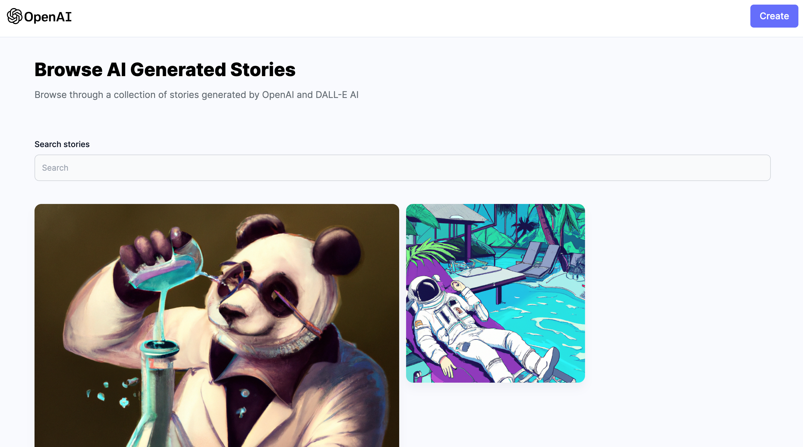

# Deep Fiction
A MERN stack website for sharing AI generated stories and images. 

## Index
- [Deep Fiction](#deep-fiction)
  - [Index](#index)
  - [About](#about)
  - [Demo](#demo)
  - [Installation](#installation)
  - [License](#license)

## About
Inspired by [FableForge](https://github.com/e-johnstonn/FableForge), Deep Fiction is a full-stack website created using MongoDB, Express, React, and Node.js. The website uses OpenAI API to generate stories and images, Cloudinary to store images, and MongoDB to store the database.

## Demo

## Installation

## License
This project is licensed under the MIT License - see the [LICENSE](./LICENSE) file for details.
