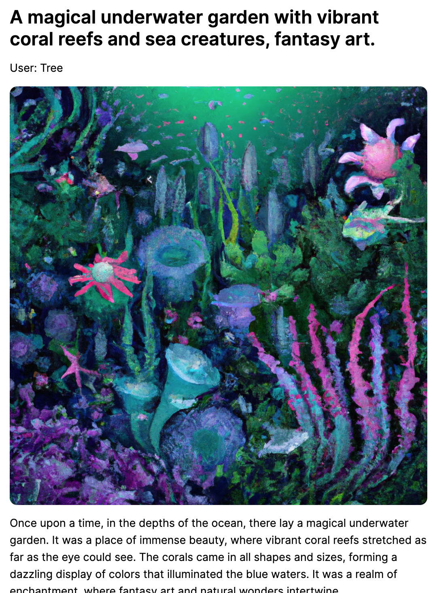
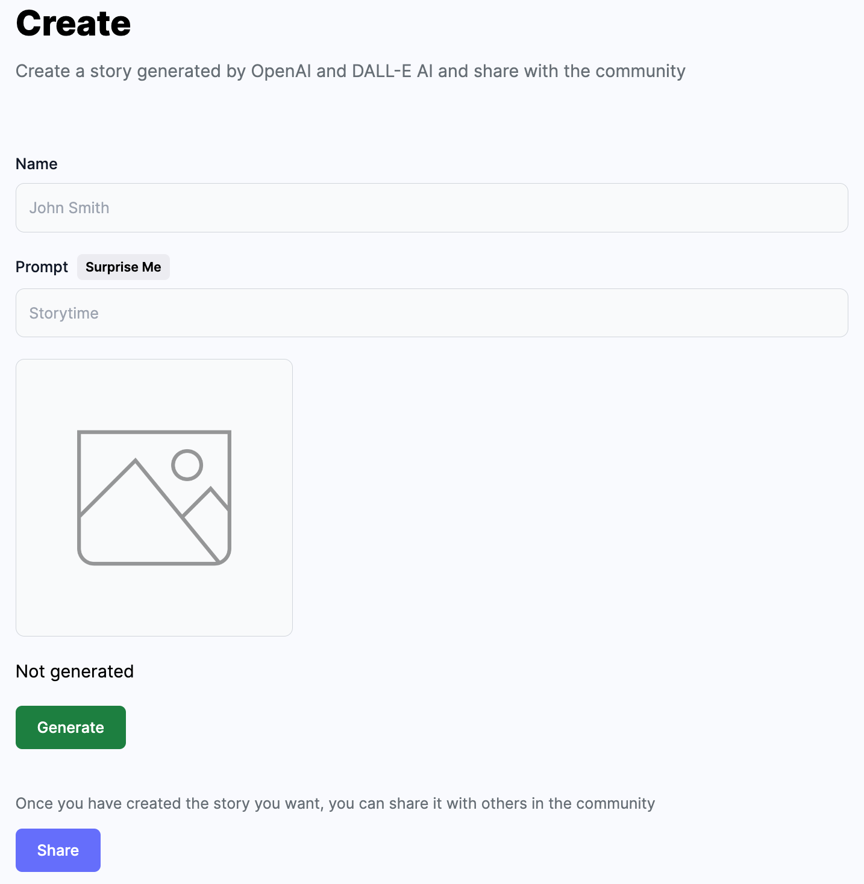

# Deep Fiction <!-- omit in toc -->
A MERN stack website for sharing AI generated stories and images.

<p align="center">

</p>

## Index <!-- omit in toc -->
- [About](#about)
- [Screenshots](#screenshots)
- [Installation](#installation)
  - [APIs](#apis)
  - [Method 1: Docker](#method-1-docker)
  - [Method 2: npm](#method-2-npm)
- [License](#license)

<a name="about"></a>
## About
Inspired by [FableForge](https://github.com/e-johnstonn/FableForge) and Tumblr, Deep Fiction is a full-stack website created using MongoDB, Express, React, and Node.js. The website uses OpenAI API to generate stories and images, Cloudinary to store images, and MongoDB to store the data.

<a name="screenshots"></a>
## Screenshots
<p align="center">
Homepage:<br>

<br>
Example story:<br>

<br>
Story Generation:<br>

</p>

<a name="installation"></a>
## Installation
The frontend will be hosted on [localhost:5173](http://localhost:5173), and the server will be hosted on [localhost:8080](http://localhost:8080).

### APIs
To run this app locally, you will need an OpenAI API, Cloudinary API, and a MongoDB API. Make sure to acquire those APIs and store them in an `.env` file. In the `.env` file, have:

```
OPENAI_API_KEY=...
MONGODB_URL=...

CLOUDINARY_CLOUD_NAME=...
CLOUDINARY_API_KEY=...
CLOUDINARY_API_SECRET=...
```

You may either use Docker or npm to install.

### Method 1: Docker 

```bash
cd client/
docker build . -t image-name
docker run -p 5173:80 -d image-name
```

```bash
cd server/
docker build . -t image-name
docker run -p 5173:80 -d image-name
```

### Method 2: npm

```bash
cd client
npm install --only=production
npm run dev
```

Open a new terminal, then:
```bash
cd server
npm install
npm start
```

<a name="license"></a>
## License
This project is licensed under the MIT License - see the [LICENSE](./LICENSE) file for details.
