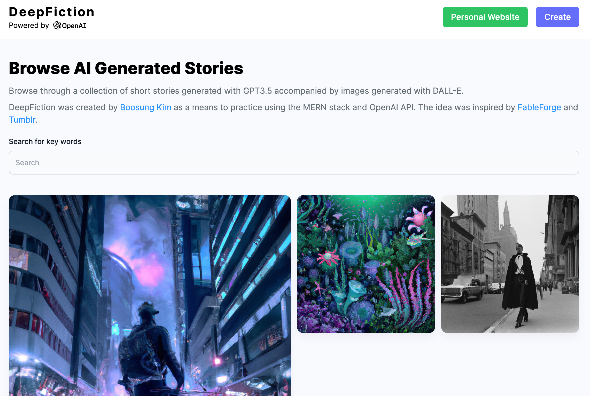

# Deep Fiction <!-- omit in toc -->
A MERN stack website for sharing AI generated stories and images.

<p align="center">

</p>

## Index <!-- omit in toc -->
- [About](#about)
- [Screenshots](#screenshots)
- [Installation](#installation)
  - [APIs](#apis)
  - [Client](#client)
  - [Server side](#server-side)
- [License](#license)

<a name="about"></a>
## About
Inspired by [FableForge](https://github.com/e-johnstonn/FableForge) and Tumblr, Deep Fiction is a full-stack website created using MongoDB, Express, React, and Node.js. The website uses OpenAI API to generate stories and images, Cloudinary to store images, and MongoDB to store the data.

<a name="screenshots"></a>
## Screenshots
<p align="center">
Homepage:<br>

<br>
Example story:<br>

<br>
Story Generation:<br>

</p>

<a name="installation"></a>
## Installation
The frontend will be hosted on localhost:5173, and the server will be hosted on localhost:8080.

### APIs
To run this app locally, you will need an OpenAI API, Cloudinary API, and a MongoDB API. Make sure to acquire those APIs and store them in an `.env` file. The required keys are: `OPENAI_API_KEY, MONGODB_URL, CLOUDINARY_CLOUD_NAME, CLOUDINARY_API_KEY, CLOUDINARY_API_SECRET`.

### Client 
Go to the `client` folder, then terminal. Run:

```bash
npm install
npm run dev
```

### Server side
Go to the `server` folder, then terminal. Run:

```bash
npm install
npm start
```

<a name="license"></a>
## License
This project is licensed under the MIT License - see the [LICENSE](./LICENSE) file for details.
